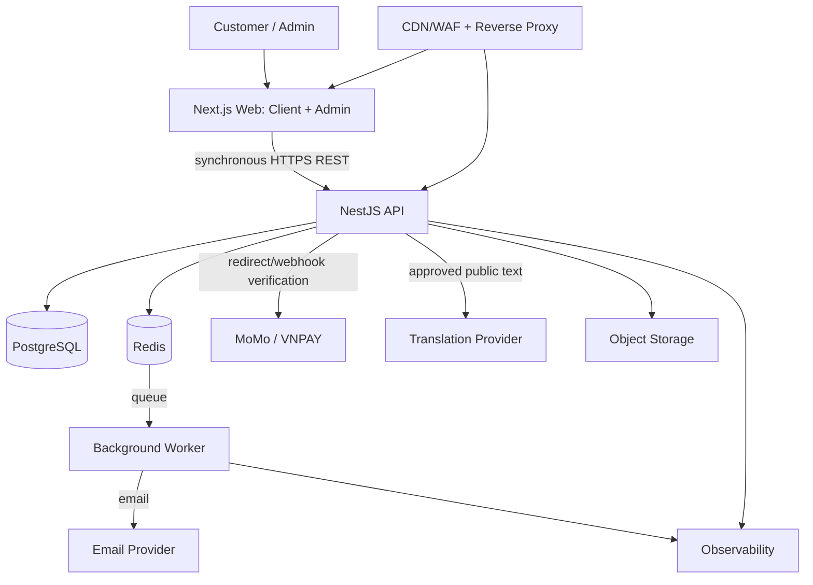

# Logical container architecture

**Trang thai:** Final - Phase 0. Day la thiet ke logical, khong la scaffold hay implementation.

| Container | Trach nhiem / owned data | Input-output | Trust/failure | Non-responsibility |
|---|---|---|---|---|
| CDN/WAF + reverse proxy | TLS termination, edge protection, routing | HTTPS in; HTTPS to origin | Public boundary; outage can block traffic | Khong xac nhan payment/authorization |
| Next.js Web | Customer/Admin UI, locale files, client validation | REST request, browser redirect | Untrusted client; failure khong doi DB | Khong tinh final price, confirm payment, enforce permission |
| NestJS API | Domain orchestration, authz, quote, HOLD, webhook verification | HTTPS REST/webhook; DB transaction | Trusted application boundary; failure fail-closed | Khong gui email inline, khong la cache authority |
| Background Worker | HOLD expiry, outbox email, retry, reconciliation tasks | Redis queue/outbox to providers | Non-interactive identity; duplicate-safe | Khong cap user permissions hay bypass guards |
| PostgreSQL | Transactional state: booking, payment mapping, coupon reservation, audit | ACID reads/writes | Source of truth; critical failure stops mutation safely | Khong serve UI/caching |
| Redis | Cache, queue coordination, rate limit support | async messages | Non-authoritative; loss requires recovery from DB/outbox | Khong so huu state nghiep vu |
| Object storage | Anh/cong khai duoc phep | signed server-mediated access | External boundary | Khong luu payment secret |
| External providers | Identity, payment, email, translation, observability | Provider-specific APIs | Untrusted external input is verified | Khong so huu platform booking state |

## Communication semantics

- **Synchronous:** browser-Web-API, quote/HOLD, administrative actions.
- **Browser redirect:** payment initiation/return URL; never authoritative.
- **Verified webhook/IPN:** provider -> API, idempotent transaction.
- **Internal queue work:** API commit -> outbox/Redis -> Worker for email, expiry and reconciliation.
- **Scaling:** Web/API horizontal behind proxy; Worker scaled by queue with idempotency; PostgreSQL scaled with transactional integrity before throughput optimization.
