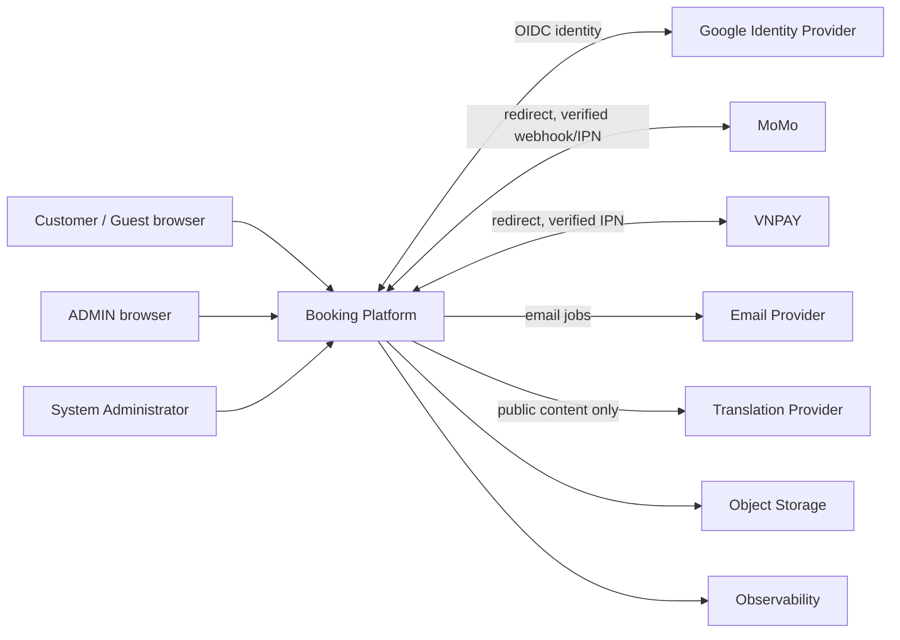

# System context

**Trang thai:** Final - Phase 0. Nen tang la he thong dat phong cho mot property. Platform so huu booking state, inventory allocation, price snapshot, coupon lifecycle va audit. Payment provider so huu external transaction outcome; platform verify va map outcome.

## Tac nhan, du lieu va trust boundary

| Boundary | Du lieu / protocol | Ownership va assumption |
|---|---|---|
| Browser -> Platform | HTTPS, public content, search, booking, session | Browser khong trusted cho amount, state hay authorization. |
| Platform -> Google | OIDC code/token flow | `sub` la identity key; phone khong duoc gia dinh. |
| Platform <-> payment provider | Browser redirect va HTTPS webhook/IPN | Return URL untrusted; signature, merchant, order, amount phai verify. |
| Platform -> email/translation | Outbox email; public text translation | Translation khong nhan PII; email payload toi thieu. |
| Platform -> storage/observability | Files cong khai duoc phep, telemetry redact | Secret va PII khong log. |

## Source of truth va availability

PostgreSQL duoc de xuat lam transactional source of truth o Phase 2 cho booking, coupon reservation, payment mapping, audit va inventory allocation. Redis la optimization/async work, khong authoritative. He thong can degrade an toan: neu provider payment hoac worker unavailable, booking khong tu xac nhan; neu cache mat, DB state van dung; neu translation unavailable, UI dung ban dich da duyet.

## Security assumptions

CDN/WAF va reverse proxy ep HTTPS, redirect HTTP sang HTTPS, TLS tu CDN den origin, Secure cookies va HSTS khi production on dinh. Flexible SSL bi cam. Payment webhook chi chap nhan qua HTTPS. Chi service identity duoc phep truy cap queue/worker.
