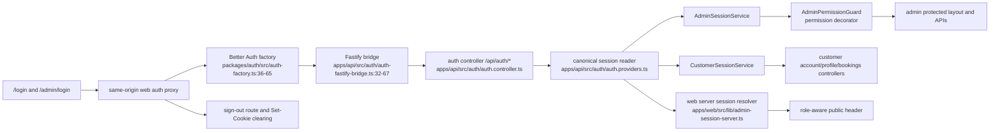
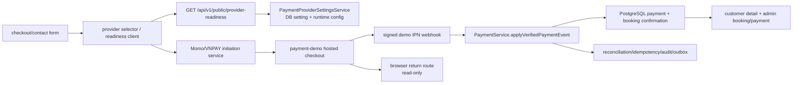
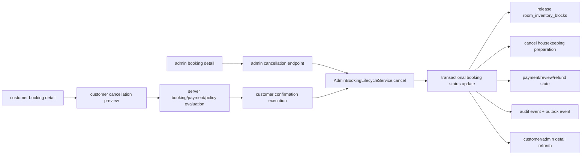
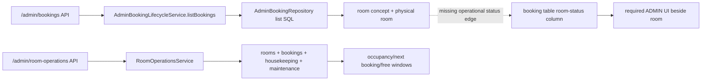

# PEACENEST P0 closure dependency graphs

This is the required pre-edit architecture record for the P0 pass.

## CodeGraph discovery and fallback

- Discovery result: the MCP tool `mcp__codegraph__codegraph_explore` is installed and callable.
- Invocation attempted before source edits:
  `mcp__codegraph__codegraph_explore({ projectPath: "D:\\Study\\Project\\Room Management", query: "auth session Better Auth customer admin payment cancellation room status" })`
- Exact result: `The project at D:\\Study\\Project\\Room Management isn't indexed with codegraph (no .codegraph/ directory found walking up from it), so codegraph cannot query it.`
- Indexing was not run because the repository rules make indexing an explicit user decision.
- `CODEGRAPH_AVAILABLE=NO` for this checkout. The graphs below are fallback evidence from current TypeScript source, NestJS metadata, Next route files, contracts, and database schema.

## AUTH GRAPH

Authoritative source nodes and edges:

- `packages/auth/src/auth-factory.ts:36-65` creates the Better Auth authority.
- `apps/api/src/auth/auth-fastify-bridge.ts:32-67` forwards inbound cookies and response `Set-Cookie` headers.
- `apps/api/src/auth/auth.controller.ts:15-90` exposes auth endpoints.
- `apps/api/src/auth/auth.providers.ts:14` reads the canonical Better Auth session.
- `apps/api/src/auth/admin-session.service.ts:22-45` resolves the admin DB actor and role.
- `apps/api/src/auth/customer-session.service.ts:30-38` wraps the same session reader and requires CUSTOMER.
- `apps/api/src/auth/admin-permission.guard.ts:24-50` enforces admin permission metadata.
- `apps/web/src/lib/admin-session-server.ts:41-123` forwards the current cookie without reusable route cache.
- `apps/web/src/components/public-header.tsx` consumes the resolved identity for public navigation.
- `apps/web/src/app/login/page.tsx`, `apps/web/src/app/admin/login/page.tsx`, `apps/web/src/app/account/layout.tsx`, and `apps/web/src/app/admin/(protected)/layout.tsx` are the route-state boundaries.

## PAYMENT GRAPH

Authoritative source nodes and edges:

- `apps/web/src/components/quote-contact-form.tsx:191` starts guest payment after HOLD/contact submission.
- `apps/web/src/components/payment-provider-selector.tsx:19-57` renders readiness and initiates CUSTOMER/guest attempts.
- `apps/api/src/auth/provider-readiness.controller.ts:7-20` serves public readiness.
- `apps/api/src/payment/services/payment-provider-settings.service.ts:38-162` joins PostgreSQL provider settings with runtime configuration.
- `apps/api/src/payment/services/momo-payment-initiation.service.ts:48-142` and `vnpay-payment-initiation.service.ts:25-83` create server-authoritative attempts.
- `apps/payment-demo/main.mjs:328-771` creates the demo checkout, confirmation and signed IPN handoff.
- `apps/api/src/payment/momo-webhook.controller.ts:19-75` and `vnpay-webhook.controller.ts:15-61` validate provider callbacks before settlement.
- `apps/api/src/payment/momo-return.controller.ts` and `vnpay-return.controller.ts` are display-only browser returns.
- `packages/booking/src/payment/payment-service.ts:364-748` owns verified event settlement, duplicate-event idempotency and booking confirmation.
- `packages/booking/src/payment/reconciliation.ts:443-1016` owns retry/reconciliation state and safe operational outcomes.
- `apps/api/src/customer/customer-bookings.controller.ts:110-148` exposes CUSTOMER-owned payment attempts/status.

## CANCELLATION GRAPH

Current source evidence and identified P0 gap:

- `apps/api/src/customer/customer-bookings.controller.ts:72-80` exposes only CUSTOMER cancellation preview; no CUSTOMER execution route exists at the time of this graph.
- `apps/api/src/customer/customer-booking.service.ts:158-194` computes a legacy binary preview (`NO_CHARGE` or `REVIEW_REQUIRED`) from full payment, not a 7-day/3-day policy snapshot.
- `apps/api/src/booking/admin-booking-operations.controller.ts:95-106` exposes ADMIN cancellation.
- `apps/api/src/booking/services/admin-booking-lifecycle.service.ts:270-350` updates booking status, releases inventory, opens paid-cancellation operational review, appends audit and outbox events.
- `packages/database/src/schema.ts:765-894` stores booking status/cancellation timestamps/reason; `1066-1134` stores payment lifecycle; `1389-1443` stores inventory blocks; `1445+` stores audit events; operational reviews are the existing manual paid-cancellation boundary.
- There is no current cancellation-policy version/refund-basis snapshot or customer execution/idempotency contract in the inspected source.

## ROOM STATUS GRAPH

Authoritative source nodes and edges:

- `apps/api/src/booking/admin-booking-operations.controller.ts:45-56` calls the booking list lifecycle.
- `apps/api/src/booking/repositories/admin-booking.repository.ts` currently returns room type, assigned room and room number but not the operational status aggregate required by this brief.
- `apps/api/src/booking/room-operations.controller.ts:11-37` exposes the separate room operations read API.
- `apps/api/src/booking/services/room-operations.service.ts:49-105` derives `currentOccupancy`, `nextBookingWindow`, housekeeping and maintenance-related room facts.
- `packages/database/src/schema.ts:387-420` defines physical room state; `902-955` defines housekeeping tasks; `1353-1387` defines maintenance blocks; `1389-1443` defines inventory blocks.
- `apps/web/src/app/admin/(protected)/bookings/page.tsx` and the booking detail page render the booking `room` field; the required adjacent `roomStatus` field is not present in the current contract/UI path.

This graph is the pre-edit root-cause map. Subsequent edits must preserve PostgreSQL authority, signed-IPN settlement, role guards, public physical-room minimization, and the existing manual paid-cancellation review boundary unless the new policy explicitly adds a forward-only refund state.

## P0 closure edges added after the pre-edit map

- CUSTOMER Server Components now call `INTERNAL_API_BASE_URL` for profile, settings, and booking detail; browser mutations retain the public `NEXT_PUBLIC_API_BASE_URL` origin.
- A booking HOLD now stores `PEACENEST_STANDARD_V1` with `PAID_AMOUNT` basis and exact 7-day/3-day deadlines in `bookings.cancellation_policy_snapshot`.
- CUSTOMER `POST /customer/bookings/:bookingCode/cancel` and ADMIN preview/execution routes use row locks, idempotency keys, release the booking inventory block, append actor-specific audit, and keep signed payment settlement review-only after cancellation.
- ADMIN booking list/detail responses now include `roomStatus` from the authoritative `rooms.status` column beside the assigned room field.
- Forward-only migration `0027_superb_sumo.sql` adds the snapshot, cancellation idempotency, refund state/amount fields, checks, and unique key index; released migrations remain unchanged.

## P0 closure delta in this pass

- The live payment root cause was cookie scope, not provider settlement: the
  HOLD guest session was previously limited to the payment-initiation path, so
  a signed demo IPN could confirm PostgreSQL while the browser redirect still
  received `401` on booking detail. `GUEST_SESSION_COOKIE_PATH` now covers the
  public booking API and is used consistently for HOLD, OTP verification, and
  logout clearing.
- `/admin/me` now returns only `emailMasked`; the admin profile also renders
  session expiry, role/department/permission scope, and logout. CUSTOMER
  profile responses include account status and the active session expiry.
- Account layout rejects ADMIN sessions before customer pages render, while
  `/admin/login` probes the same Better Auth session authority and redirects
  permitted admins or shows a controlled CUSTOMER state.
- Quote snapshots expose the same immutable cancellation policy summary before
  checkout. Customer and ADMIN previews expose paid, refund, retained amounts;
  ADMIN cancellation now fails closed for legacy bookings without a snapshot
  instead of silently inventing a policy.
