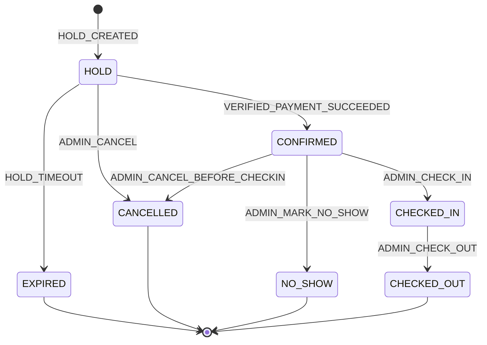
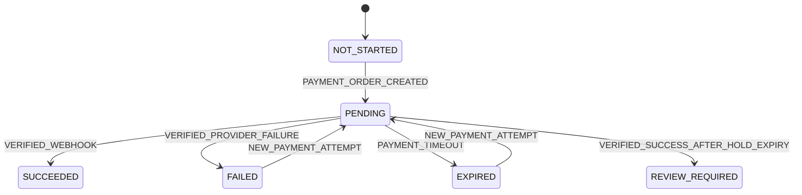

# Booking state machine va payment state machine

**Trang thai:** Final - Phase 0  
**Muc tieu:** bao ve inventory va tach booking lifecycle khoi payment lifecycle (`INV-011`).

## Booking states

| State | Nghia | Block inventory | Payment allowed | Cancellation | Terminal | Entry / exit | Audit |
|---|---|:---:|:---:|:---:|:---:|---|---|
| HOLD | Physical room da cap, cho payment, TTL 15 phut | Yes | Yes | ADMIN only | No | create HOLD; verified payment, expire, admin cancel | HOLD_CREATED |
| CONFIRMED | Payment da SUCCEEDED va duoc verify | Yes | No | ADMIN before check-in | No | verified success; check-in, no-show, admin cancel | BOOKING_CONFIRMED |
| EXPIRED | HOLD qua TTL | No | No | No | Yes | hold timeout | HOLD_EXPIRED |
| CANCELLED | ADMIN huy truoc check-in | No | No | No | Yes | admin cancel | BOOKING_CANCELLED |
| NO_SHOW | ADMIN danh dau sau expected check-in | No | No | No | Yes | admin mark no-show | BOOKING_NO_SHOW |
| CHECKED_IN | Khach dang su dung physical room | Yes | No | No | No | admin check-in; check-out | CHECKED_IN |
| CHECKED_OUT | Luu tru ket thuc | No | No | No | Yes | admin check-out | CHECKED_OUT |

`DRAFT` chi la client-local, khong persist va khong co quyen giu inventory. `PAYMENT_FAILED` va `REFUND_PENDING` khong la booking states.

## Booking transition matrix

| ID | From | Event / actor | To | Guards | Atomic data va side effect | Idempotency / failure |
|---|---|---|---|---|---|---|
| STM-001 | client DRAFT | CREATE_HOLD / Guest, CUSTOMER, ADMIN | HOLD | quote valid; 1-24h; capacity; active prices; allocate non-maintenance room | room allocation, price snapshot draft, coupon reserve, audit | same key tra HOLD cu; conflict khong block room |
| STM-002 | HOLD | VERIFIED_PAYMENT_SUCCEEDED / System | CONFIRMED | HOLD chua expiry; signature/merchant/order/amount valid | payment SUCCEEDED, coupon REDEEMED, booking CONFIRMED, audit, outbox trong mot transaction | provider event duplicate khong lap effect |
| STM-003 | HOLD | HOLD_TIMEOUT / Worker | EXPIRED | now >= expiry; van HOLD | release room/coupon, audit | lock row; retry an toan |
| STM-004 | HOLD | ADMIN_CANCEL / ADMIN | CANCELLED | chua expiry; ly do bat buoc | release room/coupon, audit | terminal response neu da cancel |
| STM-005 | CONFIRMED | ADMIN_CANCEL_BEFORE_CHECKIN / ADMIN | CANCELLED | before check-in; ly do bat buoc | release room, audit, manual review neu paid | khong auto refund |
| STM-006 | CONFIRMED | ADMIN_CHECK_IN / ADMIN | CHECKED_IN | allocated room hop le va khong maintenance | audit | repeated request tra state hien tai |
| STM-007 | CONFIRMED | ADMIN_MARK_NO_SHOW / ADMIN | NO_SHOW | expected check-in da qua; ly do bat buoc | release room, audit | khong tu dong no-show |
| STM-008 | CHECKED_IN | ADMIN_CHECK_OUT / ADMIN | CHECKED_OUT | state CHECKED_IN | release room, audit | repeated request an toan |

## Payment lifecycle doc lap

| State | Meaning | Chuyen hop le |
|---|---|---|
| NOT_STARTED | Chua co payment order | `PAYMENT_ORDER_CREATED` -> PENDING |
| PENDING | Provider dang xu ly | verified success -> SUCCEEDED; verified fail -> FAILED; deadline -> EXPIRED |
| SUCCEEDED | Ket qua thanh cong da verify | Terminal; co the trigger STM-002 neu HOLD con han |
| FAILED | Attempt that bai da verify | `NEW_PAYMENT_ATTEMPT` tao attempt PENDING moi khi HOLD con han |
| EXPIRED | Attempt qua deadline | `NEW_PAYMENT_ATTEMPT` khi HOLD con han |
| REVIEW_REQUIRED | Success den sau HOLD EXPIRed hoac mismatch can doi soat | ADMIN reconciliation ket thuc case, khong auto confirm |

## Guards, timeout va concurrency

- `INV-001`: physical room khong overlap o HOLD, CONFIRMED, CHECKED_IN; allocation va expiry dung transaction/locking phu hop.
- `INV-002`: overlap tinh theo `[checkIn, checkOut)`.
- Worker MUST re-read va lock booking truoc expiry de tranh race voi webhook. Webhook success sau expiry MUST dat REVIEW_REQUIRED (`INV-015`).
- Browser return URL MUST NOT transition booking (`INV-012`). Payment failure chi doi payment attempt; booking giu HOLD den timeout.
- Illegal transitions: EXPIRED -> CONFIRMED; CANCELLED -> CHECKED_IN; CHECKED_OUT -> CHECKED_IN; FAILED -> CONFIRMED; return URL -> CONFIRMED. Tat ca MUST bi tu choi va audit security event neu phu hop.

## Vi du test

1. Hai HOLD dong thoi cho mot physical room: chi mot transaction thanh cong.
2. Webhook duplicate sau STM-002: booking van CONFIRMED, coupon redeem mot lan, mot email.
3. Webhook success sau STM-003: payment REVIEW_REQUIRED, booking van EXPIRED.
4. ADMIN check-in booking CANCELLED: bi tu choi.

## Phase 7C persisted payment core

`payments` is the payment aggregate for one booking; `payment_attempts` records provider orders and their terminal or review result; `payment_provider_events` is a deduplicated event ledger containing provider identifiers and a digest, never a raw webhook body or secret. The aggregate can be `PENDING`, `SUCCEEDED`, `REVIEW_REQUIRED`, `CANCELLED`, or `EXPIRED`; an attempt can independently be `PENDING`, `SUCCEEDED`, `FAILED`, `CANCELLED`, `EXPIRED`, or `REVIEW_REQUIRED`.

Settlement and hold expiry use the shared lock order: booking -> payment -> payment attempt -> inventory block -> coupon application. A verified successful event confirms only a still-valid `HOLD` with active inventory, an unreleased coupon reservation, exact VND amount/currency and no provider-transaction conflict. Any late, mismatched, released, cancelled, or conflicting success is persisted as `REVIEW_REQUIRED`; it never confirms the booking. Duplicate events have no second business effect. Failed provider outcomes leave the HOLD available for retry until expiry.

Zero-final-amount bookings use a server-authoritative, idempotent no-charge confirmation flow; no provider attempt or fake provider exists. A browser return URL remains non-authoritative.
