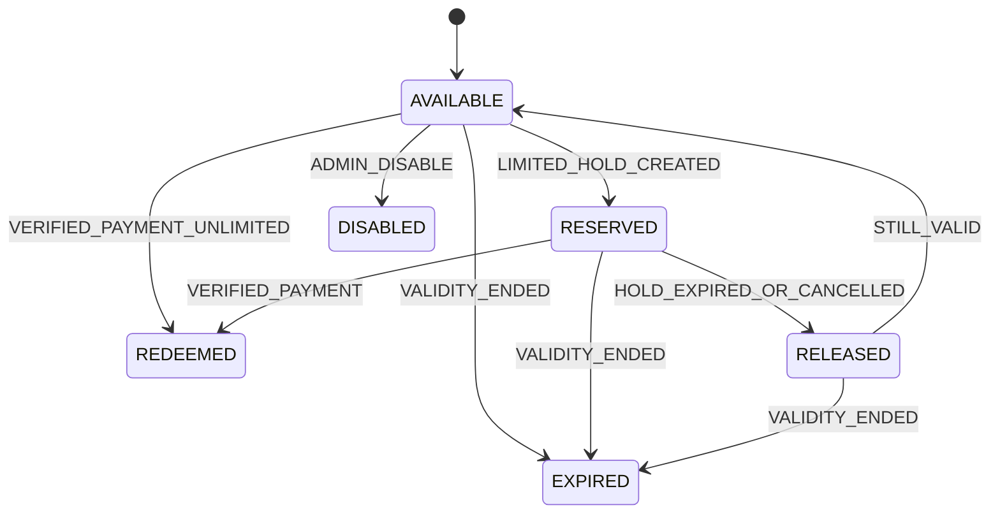

# Quy tac coupon

**Trang thai:** Final - Phase 0. **Muc tieu:** giam gia co cau hinh, khong vuot limit khi dong thoi va khong tin discount tu client.

## Cau hinh va lifecycle

Coupon co `discountType` (fixed amount hoac percentage), `discountValue`, `maximumDiscount`, `minimumOrderAmount`, `validFrom`, `validUntil`, applicable room types, `totalUsageLimit` nullable va `perCustomerLimit` nullable. `totalUsageLimit=null` nghia la multi-use khong gioi han toan cuc; cac limit khac van duoc thuc thi neu cau hinh. Guest duoc nhan dien cho per-customer limit bang `normalizedEmailHash`, khong dua vao IP.

| State | Nghia | Chuyen vao | Chuyen ra |
|---|---|---|---|
| AVAILABLE | Active va con dieu kien dung | create/RELEASED khi con han | RESERVED, EXPIRED, DISABLED |
| RESERVED | Luot coupon limited da giu cho HOLD | HOLD_CREATED | REDEEMED, RELEASED, EXPIRED |
| REDEEMED | Da dung trong verified payment success | PAYMENT_VERIFIED | Terminal |
| RELEASED | Reservation duoc tra lai | HOLD_EXPIRED/CANCELLED; neu con han | AVAILABLE hoac EXPIRED |
| EXPIRED | Het validity window | validity end | Terminal |
| DISABLED | ADMIN ngung coupon | ADMIN_DISABLE | Terminal; reservation da ton tai duoc release theo policy huy/expiry |

`RESERVED` la persisted coupon-reservation record gan booking HOLD, khong la global coupon state duy nhat. Coupon co the van AVAILABLE cho cac booking khac khi con quota.

## CPN-001 - Thu tu validate authoritative

1. Normalize code.
2. Tim active coupon.
3. Kiem tra validity window.
4. Kiem tra property/room type/date scope.
5. Kiem tra minimum booking amount.
6. Kiem tra total usage limit bao gom active reservations.
7. Kiem tra per-customer limit bang normalized email hash.
8. Kiem tra stacking: MVP chi cho mot coupon tren mot booking.
9. Tinh discount, ap dung maximum discount cho percentage.
10. Tai tinh final price server-side.
11. Revalidate va reserve/redeem trong transaction phu hop.

Quote chi validate va tinh thu, khong consume hay reserve. HOLD reserve chi khi coupon co total/per-customer limit; coupon unlimited khong can chiem quota nhung van co audit association. He thong MUST chi tao HOLD coupon neu `validUntil` bang hoac sau `holdExpiresAt`; do do reservation hop le duoc redeem trong suot HOLD. Verified payment success redeem reservation; HOLD expiry hoac ADMIN cancellation release reservation neu coupon con valid. Payment failure khong redeem coupon va customer co the retry khi HOLD con han.

## Concurrency, cancellation va audit

- `CPN-002`: Hai HOLD cung tranh luot cuoi phai lock/cap nhat atomic; chi mot reservation thanh cong.
- `CPN-003`: Duplicate webhook khong redeem them coupon.
- `CPN-004`: Coupon da EXPIRED/DISABLED khong ap dung cho HOLD moi. State change coupon/reservation, validation failure do limit va override ADMIN MUST ghi audit.
- Admin co the tao coupon fixed/% va phan phoi qua email cho email da dat, nhung email distribution MUST dung opt-in/operational basis va khong tiet lo coupon recipient khac.
- Khong co automated refund. Cancellation booking da paid tao manual review; coupon restoration sau refund khong nam MVP va khong duoc tu dong lam.

## Test matrix

| Tinh huong | Ket qua bat buoc |
|---|---|
| Coupon fixed dat max | discount khong vuot gross amount |
| Percentage vuot maximumDiscount | discount bang maximumDiscount |
| Hai khach tranh quota=1 | mot RESERVED, mot validation failure |
| HOLD expiry | RELEASED, quota kha dung lai neu coupon con han |
| Payment failure | con HOLD, coupon van RESERVED cho den retry/expiry |
| Verified success lap lai | mot REDEEMED va mot business effect |
| Guest doi IP | limit van dua normalizedEmailHash |
| Verified success after reservation RELEASED | payment REVIEW_REQUIRED; no re-redeem or room confirmation |

## Phase 7C settlement guard

Coupon redemption is part of the same database transaction as a verified successful payment, booking confirmation, audit and outbox write. A success received after the reservation is `RELEASED` is an operational reconciliation case (`REVIEW_REQUIRED`), not a reason to recreate/redeem a coupon. A valid zero-amount booking may redeem through the server-authoritative no-charge settlement path; there is no fake payment provider.
