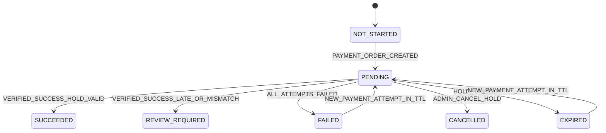

# Payment state machine

**Trang thai:** Final - Phase 7C; supplemented Phase 8C.
**Muc tieu:** mo ta payment aggregate, payment attempt va provider-event ledger, va cac
reconciliation outcomes (Phase 8C) tren payment aggregate.

Payment lifecycle doc lap voi booking lifecycle (`INV-011`,
`docs/architecture/adr/ADR-0006-payment-core-settlement.md`). Booking
chi transition tu `HOLD` sang `CONFIRMED` qua payment aggregate; payment aggregate khong
doi booking.

## 1. Payment aggregate states (`payments`)

| State | Meaning | Allowed transitions |
| --- | --- | --- |
| `NOT_STARTED` | Chu co payment order cho booking. | `PENDING` khi `PAYMENT_ORDER_CREATED`. |
| `PENDING` | Co it nhat mot attempt dang xu ly; booking van HOLD. | `SUCCEEDED` verified success + HOLD con han; `REVIEW_REQUIRED` verified success sau HOLD expiry hoac amount/currency mismatch; `CANCELLED` ADMIN huy truoc confirm; `EXPIRED` HOLD qua TTL neu khong confirm duoc. |
| `SUCCEEDED` | Verified success; booking da CONFIRMED. | Terminal. |
| `FAILED` | Khong co attempt nao con PENDING va khong co attempt SUCCEEDED; booking van HOLD neu con TTL. | `PENDING` khi ADMIN retry mot attempt moi trong TTL. |
| `EXPIRED` | HOLD qua TTL va khong co attempt SUCCEEDED trong window do. | Terminal; booking EXPIRED. |
| `CANCELLED` | ADMIN huy truoc confirm. | Terminal; booking CANCELLED. |
| `REVIEW_REQUIRED` | Verified success den sai context (sau HOLD expiry, sau ADMIN cancel, amount mismatch, transaction conflict, coupon released, inventory released, cross-provider race). | Terminal; ADMIN operational review quyet dinh; khong tu confirm. |

## 2. Payment attempt states (`payment_attempts`)

| State | Meaning | Allowed transitions |
| --- | --- | --- |
| `PENDING` | Provider dang xu ly. | `SUCCEEDED`/`FAILED`/`CANCELLED`/`EXPIRED` tu verified IPN hoac tu reconciliation cycle; `REVIEW_REQUIRED` tu verified IPN khi booking context khong con hop le. |
| `SUCCEEDED` | Verified success cua attempt nay. | Terminal. |
| `FAILED` | Verified failure cua attempt nay. | Terminal; co the tao attempt moi neu booking con TTL. |
| `CANCELLED` | Provider hoac ADMIN huy attempt. | Terminal. |
| `EXPIRED` | Provider deadline qua. | Terminal; co the tao attempt moi neu booking con TTL. |
| `REVIEW_REQUIRED` | Verified success den nhung amount/coupon/inventory conflict. | Terminal. |

## 3. Reconciliation outcomes (Phase 8C)

Phase 8C them cac column len `payment_attempts` de worker tick theo doi
vong doi reconciliation: `reconciliation_attempt_count`,
`next_reconciliation_at`, `last_reconciled_at`, `last_error_code`,
`lease_owner`, `lease_expires_at`. Cac outcome duoi day duoc ghi vao
`last_error_code` va quyet dinh tiep theo cua worker:

| Outcome | Trigger | Last error code | Next action |
| --- | --- | --- | --- |
| `PROCESSED` | Provider tra `SUCCEEDED` matching attempt amount/merchant/order. | (cleared) | Feed `applyVerifiedPaymentEvent`; clear lease; advance `last_reconciled_at`. |
| `TERMINAL_NOT_FOUND` | Provider tra `NOT_FOUND` qua minimum grace. | `PROVIDER_NOT_FOUND` | Clear lease; no schedule. |
| `TERMINAL_REVIEW_REQUIRED` | Provider tra `FAILED`/`CANCELLED`/`EXPIRED`. | `PROVIDER_CONFIRMED_*` | Clear lease; no schedule. |
| `STALE_FAILURE_PROTECTED` | Provider tra `FAILED` nhung attempt da SUCCEEDED tu IPN muon hon. | `STALE_FAILURE_PROTECTED` | Clear lease; do not retry. |
| `TRANSIENT_RETRY_SCHEDULED` | Provider tra `PENDING` hoac network failure. | `PROVIDER_TIMEOUT` / `PROVIDER_UNREACHABLE` / `PROVIDER_INVALID_RESPONSE` | Bump `reconciliation_attempt_count`; set `next_reconciliation_at = now + delayMinutes[i]`; keep lease. |
| `PERMANENT_RETRY_EXHAUSTED` | `reconciliation_attempt_count >= maxAttempts`. | `TRANSIENT_RETRY_EXHAUSTED` | Clear lease; open operational review with `RECONCILIATION_EXHAUSTED`. |
| `PERMANENT_REVIEW_REQUIRED` | Provider tra payload/merchant/order/transaction mismatch. | `PROVIDER_PAYLOAD_INVALID` / `PROVIDER_MERCHANT_MISMATCH` / `PROVIDER_ORDER_MISMATCH` / `PROVIDER_AMOUNT_MISMATCH` / `PROVIDER_TRANSACTION_MISMATCH` / `PROVIDER_SIGNATURE_INVALID` | Clear lease; open operational review with `RECONCILIATION_NOT_FOUND` (or appropriate category). |
| `LEASE_LOST` | Lease expired mid-cycle. | `LEASE_LOST` | Bump `reconciliation_attempt_count`; schedule next attempt. |

`RECONCILIATION_TRANSIENT` va `RECONCILIATION_STALE_FAILURE` duoc ghi trong
operational review neu can thiet cho ADMIN can bang; reconciliation worker khong tu tao review voi nhung category nay neu outcome la retry-scheduled hay protected.

## 4. Reconciliation policy bounds

| Knob | Min | Max | Default |
| --- | --- | --- | --- |
| `maxAttempts` | 1 | 32 | 8 |
| `delayMinutes[i]` | 1 | 1440 | `[1, 5, 15, 60, 240]` |
| Batch size | 1 | 200 | 50 |
| Lease TTL ms | 1000 | 300000 | 30000 |
| Provider query timeout ms | 1000 | 60000 | 10000 |

Values outside bounds throw `RangeError` before any database write (`validateReconciliationPolicy`, `validateReconciliationClaimOptions`).

## 5. Operational review categories (Phase 8C)

`/api/v1/admin/operational-reviews` nhan mot so category moi:

- `RECONCILIATION_EXHAUSTED` — reconciliation cycle exhausted attempts.
- `RECONCILIATION_TRANSIENT` — transient retry required admin attention (rare).
- `RECONCILIATION_NOT_FOUND` — provider reports the order is unknown after grace.
- `RECONCILIATION_STALE_FAILURE` — provider failure but attempt already settled.
- `CROSS_PROVIDER_TRANSACTION_CONFLICT` — two providers attempted to settle the same booking; one was downgraded.

Categories cu tu Phase 7G (`PAID_CANCELLATION`) van ap dung.

## 6. Guards, race va concurrency

- `INV-031`: Payment events deduplicate by provider plus provider event id; raw webhook payloads va secrets khong persist hoac log.
- `INV-032`: Verified success chi confirm unexpired HOLD voi ACTIVE inventory, unreleased coupon reservation, exact VND amount/currency va khong transaction conflict.
- `INV-033`: Zero-amount booking confirmed qua server-side idempotent no-charge flow.
- Phase 8C them:
  - Reconciliation cycle co lease + `FOR UPDATE SKIP LOCKED` de dam bao single-writer ownership trong mot tick.
  - `payments_property_booking_uq` unique constraint dam bao cross-provider race co mot winner duy nhat.
  - Reconciliation cycle chi doc provider; khong co settlement-mutation path nao moi.

## 7. Vi du test

1. MoMo checkout timeout: worker tick query provider -> SUCCEEDED -> confirm booking qua canonical core; lease cleared.
2. MoMo checkout timeout + provider returns PENDING 8 lan: worker tick ghi
   `reconciliation_attempt_count = 8`, `last_error_code = TRANSIENT_RETRY_EXHAUSTED`,
   operational review `RECONCILIATION_EXHAUSTED` mo.
3. MoMo success vs VNPAY success cung booking: mot `SUCCEEDED`, mot
   `REVIEW_REQUIRED` voi `CROSS_PROVIDER_TRANSACTION_CONFLICT`.
4. Worker tick chang du lease: outcome `LEASE_LOST`, schedule next attempt,
   khong double-write `payment_attempt_count`.
5. SUCCESS verified IPN sau ADMIN cancel: payment aggregate `REVIEW_REQUIRED`,
   booking `CANCELLED`, operational review `PAID_CANCELLATION`.