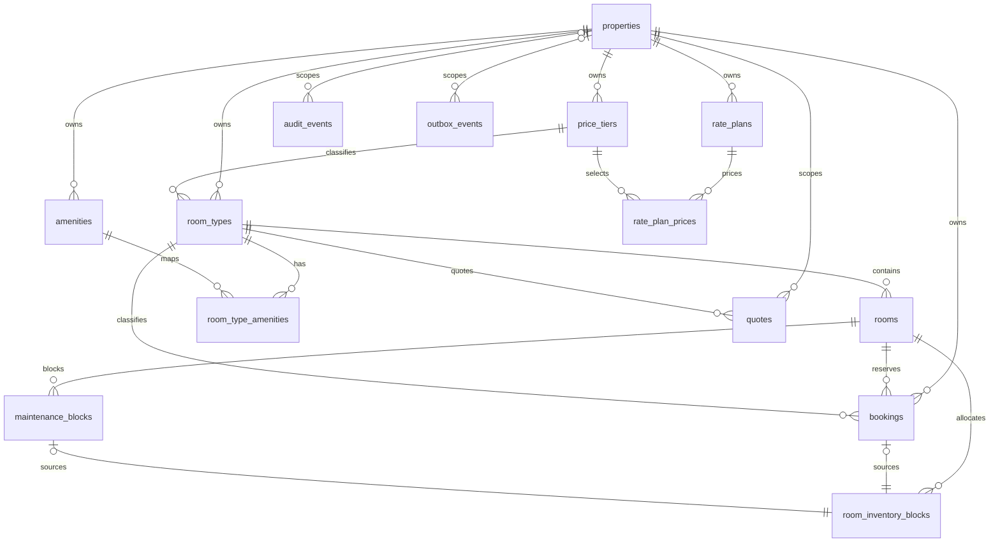

# Phase 4 database schema

The generated Drizzle schema and immutable SQL migrations are authoritative. PostgreSQL owns all referential integrity, money checks (VND bigint), timestamp checks, and inventory exclusion.

| Area         | Tables                                                                                 | Integrity boundary                                                                                                                    |
| ------------ | -------------------------------------------------------------------------------------- | ------------------------------------------------------------------------------------------------------------------------------------- |
| Metadata     | `schema_metadata`                                                                      | Singleton `phase-4-pricing-availability-v1` version marker.                                                                           |
| Catalog      | `properties`, `price_tiers`, `room_types`, `rooms`, `amenities`, `room_type_amenities` | Property-scoped keys and codes; room type/capacity and room identity checks.                                                          |
| Pricing      | `rate_plans`, `rate_plan_prices`                                                       | Enumerated plan codes, VND positive amounts, one price per plan/tier.                                                                 |
| Quotes       | `quotes`                                                                               | Quarter-hour interval, occupancy, database-time expiry, non-empty JSON snapshot and trigger-enforced immutability.                    |
| Booking      | `bookings`                                                                             | Property/room consistency, quarter-hour interval, occupancy, VND arithmetic, non-empty price snapshot, immutable hold/snapshot facts. |
| Availability | `maintenance_blocks`, `room_inventory_blocks`                                          | One source per ledger row and GiST exclusion of overlapping active physical-room allocations.                                         |
| Operations   | `audit_events`, `outbox_events`                                                        | Append-only audit trigger; valid outbox publication state and retry facts.                                                            |

Important custom SQL in `0001_custom_invariants.sql` enables `btree_gist`, adds the inventory exclusion constraint and operational indexes, makes catalog identifiers case-insensitive, and installs audit/booking immutability triggers. This SQL is intentional policy, not generated output to edit casually.
