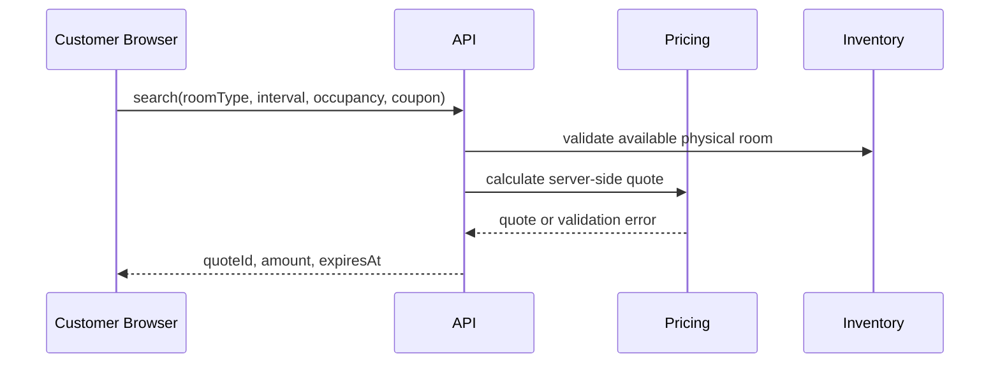
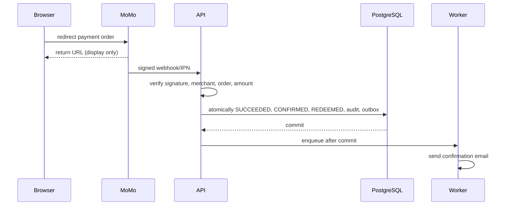
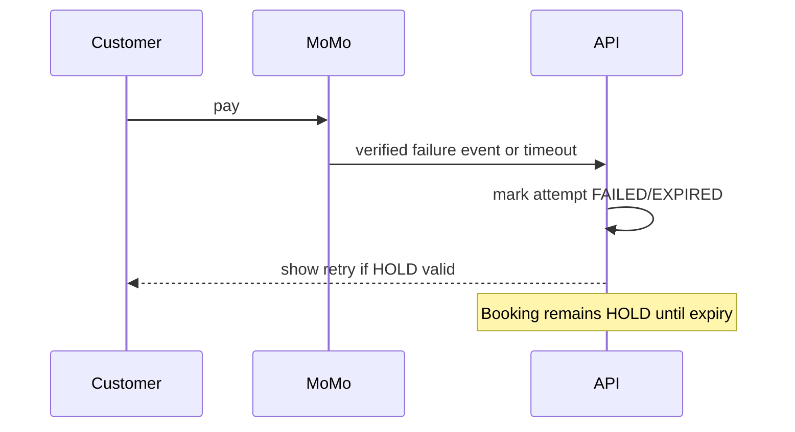
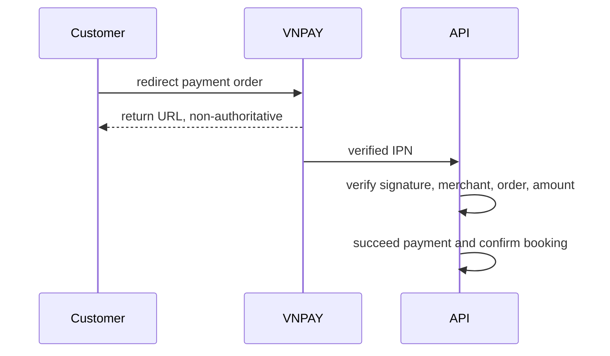
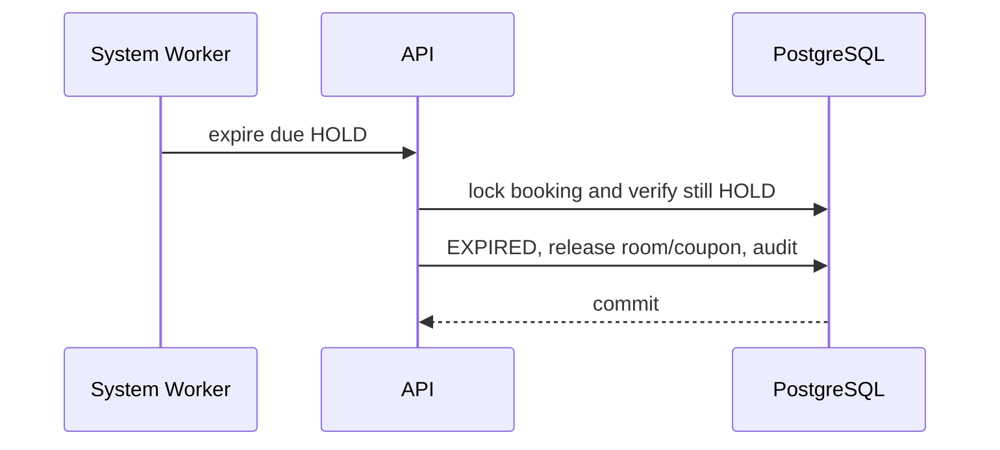
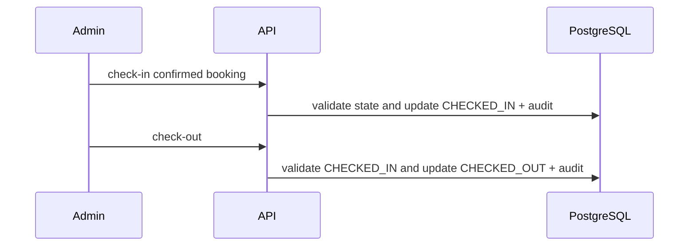

# Hanh trinh nguoi dung

**Trang thai:** Final - Phase 0  
**Quy uoc:** Booking state dung [booking-state-machine](../domain/booking-state-machine.md); payment state dung [payment-state-machine](../domain/payment-state-machine.md); moi amount duoc tinh server-side.

## JRN-001 - Search availability va quote

**Public entry:** `/` is the customer booking start. The header links to `/booking/manage` for guest booking access and `/login` for CUSTOMER login; an authenticated CUSTOMER sees profile and booking-list links. `/booking/search` remains a supported direct route with the same authoritative availability form. ADMIN management remains under `/admin` and is not linked from public booking results.

**Actor:** Guest/CUSTOMER. **Precondition:** room type va active rate plan ton tai. **Trigger:** nhap check-in, check-out, adults, children va room type.

1. Client gui input 15-phut den API; API doi timezone tai boundary va validate 1-24 gio, capacity, maintenance va availability.
2. API ap dung chinh sach `CHEAPEST_ELIGIBLE_THEN_PRIORITY` (Phase 8B), chi dung rule ACTIVE co amount integer VND duong; coupon neu co chi validate/tinh thu.
3. API tra quote co `quoteId`, expiry 15 phut, gia snapshot tam thoi va rule version `phase-8b-cheapest-eligible-pricing-v1`.
4. Quote page tu dong yeu cau goi y khung gio tu `POST /api/v1/recommendations/stay-times`. Gợi ý chi hien thi so sanh thoi gian/gia; chon goi y tao quote moi va khong thay doi booking, HOLD, inventory hoac coupon cu.

Failure: input sai, khong con physical room, rule thieu gia hoac coupon khong hop le tra loi co ma loi, khong tao HOLD. Postcondition: inventory chua bi block.



## JRN-002 - Tao HOLD va payment order

**Actor:** Guest/CUSTOMER. **Precondition:** quote con han va contact detail hop le. **Validation:** phone bat buoc; adult >= 1; capacity hop le; coupon limited duoc reserve transactionally.

1. API tai tinh quote, cap mot physical room trong transaction va tao booking `HOLD` 15 phut.
2. API tao payment order va payment attempt `PENDING`; booking van `HOLD`.
3. Browser duoc redirect den provider. Cung idempotency key phai tra payment order hien co.

Failure: tran inventory/coupon, quote expired hoac provider order creation failure khong duoc tao booking confirmed. Recovery: neu HOLD con han, customer tao attempt moi.

## JRN-003 - MoMo payment thanh cong



**Postcondition:** verified `SUCCEEDED` chuyen HOLD sang CONFIRMED, coupon reservation sang REDEEMED va inventory tiep tuc bi block. Return URL khong thay doi state.

## JRN-004 - MoMo failure hoac timeout



Neu HOLD het han: booking EXPIRED, coupon reservation RELEASED va physical room duoc mo khoa. Khach khong the retry tren HOLD cu.

## JRN-005 - VNPAY payment success

VNPAY dung cung semantics voi MoMo: signed IPN la authoritative, return URL chi dieu huong, payment `SUCCEEDED` atomically confirm booking. Provider-specific signature va merchant verification nam trong payment adapter.



## JRN-006 - VNPAY payment failure, timeout va late success

```mermaid
sequenceDiagram
  participant C as Customer
  participant V as VNPAY
  participant A as API
  V->>A: verified failure IPN or no payment before deadline
  A->>A: mark FAILED or EXPIRED attempt
  A-->>C: retry only while HOLD valid
  V->>A: verified success after HOLD expiry
  A->>A: mark REVIEW_REQUIRED; no auto-confirmation
```

## JRN-007 - Duplicate webhook va late payment

Duplicate webhook duoc nhan dien boi provider event/order identity va xu ly idempotent: neu business effect da commit, API tra acknowledgement an toan ma khong gui them email hay redeem them coupon. Payment success sau HOLD EXPIRed chuyen payment sang REVIEW_REQUIRED va tao reconciliation item; ADMIN quyet dinh van hanh, khong co auto-confirmation.

## JRN-008 - HOLD expiry



## JRN-009 - Van hanh booking

- **Cau hinh:** ADMIN tao room type, physical room, maintenance block, price tier/rule va coupon. Rule thieu amount MUST NOT ACTIVE.
- **Tra cuu:** ADMIN search booking va payment; payment mismatch duoc gan reconciliation, khong sua ket qua webhook.
- **Cancellation:** ADMIN chi huy truoc check-in. Booking da thanh toan tao manual operational review; refund tu dong khong co.
- **Check-in/out:** ADMIN check-in chi tu CONFIRMED; check-out chi tu CHECKED_IN. ADMIN danh dau NO_SHOW sau expected check-in; he thong khong auto mark no-show.



## JRN-010 - Advisory flexible-time recommendations (Phase 8B)

- **Actor:** Guest/CUSTOMER. **Trigger:** khach muon xem co khung gio nao re hon khong.
- **Precondition:** `POST /api/v1/recommendations/stay-times` voi input giong quote va optional `couponCode`.
- **Flow:**
  1. API dung `calculatePricing` voi chinh sach `CHEAPEST_ELIGIBLE_THEN_PRIORITY` cho exact interval.
  2. API walk offsets `±60 phut` trong buoc `15 phut`, recheck availability qua `RecommendationRepository.isCandidateAvailable`.
  3. Moi candidate available duoc pricing qua cung pricing domain; coupon (neu co) duoc preview khong reserve.
  4. API tra `recommendations` (toi da 3) kem `generatedAt` va `advisoryExpiresAt`.
- **Postcondition:** khong co phong bi cap, khong co coupon bi tru, khong co HOLD hay quote persistent duoc tao. Khach phai bam chon va tao quote moi qua endpoint quote chinh.

## JRN-011 - MoMo checkout timeout, payment reconciliation (Phase 8C)

- **Actor:** Guest/CUSTOMER (qua MoMo browser redirect), MoMo, API, Worker.
- **Trigger:** MoMo `POST /v2/gateway/api/create` tra loi timeout hoac malformed response trong khi browser dang mo.
- **Precondition:** booking HOLD con TTL; payment attempt row da ton tai voi status `PENDING`.
- **Flow:**
  1. Browser dang redirect toi MoMo nhung khong co response; API nhan `MOMO_INITIATION_OUTCOME_UNKNOWN` review.
  2. Worker tick claim attempt voi `FOR UPDATE SKIP LOCKED`, lease TTL mac dinh 30s.
  3. Worker query `POST /v2/gateway/api/query` voi canonical `accessKey=...&orderId=...&partnerCode=...&requestId=...`, HMAC-SHA256 ky.
  4. MoMo tra `SUCCEEDED` matching amount/transaction: worker feed `applyVerifiedPaymentEvent` voi synthetic verified marker; booking CONFIRMED nguyen ven transactional core.
  5. MoMo tra `PENDING` hoac network failure: worker bump `reconciliation_attempt_count`, schedule next delay theo policy, giu lease den expiry.
  6. MoMo tra `FAILED`/`CANCELLED`/`EXPIRED`: worker ghi `last_error_code = PROVIDER_CONFIRMED_*`, clear lease, no schedule.
  7. Worker `reconciliation_attempt_count >= maxAttempts` (default 8): open operational review voi category `RECONCILIATION_EXHAUSTED`, ADMIN resolve.
- **Postcondition:** booking chi CONFIRMED khi provider tra SUCCESS qua canonical core; raw query response, raw URL, signature, secret khong bao gio duoc persist hoac log.

## JRN-012 - VNPAY IPN lost, query-driven reconcile (Phase 8C)

- **Actor:** Guest/CUSTOMER, VNPAY, API, Worker.
- **Trigger:** VNPAY sandbox/production IPN khong den (network, firewall, misconfig).
- **Precondition:** booking HOLD con TTL; payment attempt `PENDING`; `next_reconciliation_at <= now()`.
- **Flow:**
  1. Worker tick claim attempt voi `FOR UPDATE SKIP LOCKED`.
  2. Worker query `vnp_QueryDr` voi sorted `vnp_*` canonical (HMAC-SHA512), URL-encoded `k=v`, exclude SecureHash.
  3. VNPAY tra `vnp_ResponseCode = 00` matching amount/transaction: worker feed canonical core; booking CONFIRMED.
  4. VNPAY tra amount/transaction mismatch: worker ghi `PROVIDER_AMOUNT_MISMATCH`, clear lease, open review `RECONCILIATION_NOT_FOUND` (or appropriate category).
  5. VNPAY timeout: worker schedule next delay.
- **Postcondition:** giong JRN-011; bi truyen VNPAY amount scaling ×100 (current adapter sends raw VND) va space encoding `+` vs `%20` (`EXTERNAL_BLOCKED`).

## JRN-013 - Cross-provider race, one confirmed, one review (Phase 8C)

- **Actor:** Guest/CUSTOMER, MoMo, VNPAY, API.
- **Trigger:** khach start ca MoMo va VNPAY attempt cho cung booking truoc khi mot trong hai confirm.
- **Precondition:** booking HOLD; payment aggregate `PENDING`; hai `payment_attempts` rows MOMO va VNPAY.
- **Flow:**
  1. Ca hai IPN den cung lan luot; settlement lock order `booking -> payment -> payment_attempt -> inventory_block -> coupon_application`.
  2. IPN dau tien commit: booking CONFIRMED, payment SUCCEEDED, coupon REDEEMED, audit/outbox.
  3. IPN thu hai gap unique `payments_property_booking_uq`; downgrade thanh `REVIEW_REQUIRED` voi category `CROSS_PROVIDER_TRANSACTION_CONFLICT`.
  4. ADMIN resolve qua `/api/v1/admin/operational-reviews/:reviewId/resolve`.
- **Postcondition:** chi mot CONFIRMED, mot coupon REDEEMED, mot email confirmation; khong auto-confirm lan thu hai.

## JRN-014 - Reconciliation lease lost, retry (Phase 8C)

- **Actor:** Worker tick A, Worker tick B (cung process, sequential).
- **Trigger:** Worker tick A claim attempt nhung khong commit trong lease TTL (process restart, GC pause, exception).
- **Precondition:** attempt `PENDING`; lease owner `worker-A`, `lease_expires_at <= now()`.
- **Flow:**
  1. Worker tick B thay lease expired; SELECT FOR UPDATE SKIP LOCKED tra ve attempt.
  2. Worker tick B query provider; outcome `LEASE_LOST` neu lease bi mat mid-cycle.
  3. Worker tick B bump `reconciliation_attempt_count`, schedule next delay, ghi `LEASE_LOST`.
  4. Worker tick A (neu con song) commit: attempt thay lease khong match; rollback.
- **Postcondition:** `reconciliation_attempt_count` duoc bump dung mot lan per cycle; khong double-write; settlement khong bi anh huong.

## JRN-015 - ADMIN sends selected coupons to the booking contact (Phase 8D)

- **Actor:** authorized ADMIN, worker, booking contact.
- **Flow:** ADMIN selects active property coupons and explicitly confirms. The browser sends only codes and an idempotency key. The API derives the booking contact recipient, writes the outbox and a count-only audit event atomically, and the worker marks the stored request `SENT` after mail dispatch.
- **Safety:** no arbitrary recipient, no coupon reservation/redemption, no raw recipient/body in logs, and a repeated idempotency key returns the original delivery.
