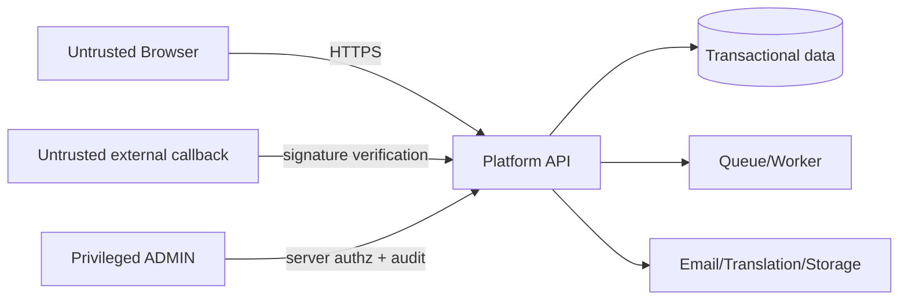

# Threat model

**Trang thai:** Final - Phase 0  
**Phuong phap:** STRIDE theo OWASP; risk level duoc danh gia cho MVP truoc control.

## Scope, assets va boundaries

Assets: room inventory, booking state, pricing rules/snapshots, coupons, payment references/credentials, identity, customer PII, sessions, ADMIN permissions, audit log, password-reset va OTP token. Entry points: browser REST, Google OAuth redirect, payment return/webhook/IPN, admin API, queue/worker, email/translation integrations, upload/object storage. Attacker profiles: anonymous bot, malicious customer, compromised account, forged provider caller, insider ADMIN, compromised dependency.

## STRIDE threat matrix

| ID | STRIDE / scenario | Asset, actor, entry | Risk | Preventive / detective / recovery | Related invariant |
|---|---|---|---|---|---|
| THR-001 | Tampering: double-booking race | inventory; concurrent customer; HOLD | Critical | DB transaction/locking; allocation conflict metrics; release/reconcile | INV-001..004 |
| THR-002 | Tampering: client price change | price; malicious browser; REST | High | server quote/snapshot; mismatch log; reject/requote | INV-005..007 |
| THR-003 | Tampering: coupon race | coupon quota; concurrent guest | High | transactional reservation; quota alerts; release expired holds | INV-017..020 |
| THR-004 | Spoofing: forged return URL | booking state; attacker browser | High | return non-authoritative; audit denied transition; show pending status | INV-012 |
| THR-005 | Spoofing/tampering: forged webhook | payment/booking; fake caller | Critical | HTTPS/signature/merchant/order/amount verification; security log; reject/reconcile | INV-013 |
| THR-006 | Repudiation/replay: duplicate webhook | payment/coupon/email | High | idempotency event key; duplicate metric; replay-safe acknowledgement | INV-014 |
| THR-007 | Tampering: payment amount mismatch | revenue; provider callback | Critical | compare immutable order amount; alert; REVIEW_REQUIRED | INV-007,013 |
| THR-008 | Information disclosure: booking IDOR | PII/booking; customer | High | ownership or email OTP; denied-access audit; revoke session | INV-023 |
| THR-009 | Elevation: staff privilege escalation | ADMIN data; customer/staff | Critical | server RBAC, MFA production, least privilege; authz audit; disable account | INV-021,022 |
| THR-010 | Spoofing: ADMIN account takeover | permissions; attacker | Critical | MFA, password controls, rate limit; unusual-login alert; session revoke | SEC-003 |
| THR-011 | Spoofing: OAuth state/redirect misuse | identity/session | High | OIDC state/nonce/redirect allow-list; failed-flow logging; revoke tokens | INV-024 |
| THR-012 | Spoofing: reset/OTP abuse | account/booking | High | one-time expiry, rate limit, hashed token; attempt alert; invalidate tokens | INV-023 |
| THR-013 | Information disclosure: log leak | secrets/PII; operator | High | redaction allow-list; log scanner; rotate/revoke exposed credential | INV-026 |
| THR-014 | Tampering/repudiation: audit modification | audit log; insider | High | append-only access, restricted DB role; integrity monitoring; restore/investigate | INV-025 |
| THR-015 | DoS: brute force booking/coupon | availability/revenue; bot | High | WAF/rate limits/idempotency; anomaly dashboard; temporary throttle | SEC-003 |
| THR-016 | DoS: availability search flood | API/DB; bot | Medium | cache safe public queries, rate limit, query bounds; saturation alert; degrade safely | INV-016 |
| THR-017 | Tampering: malicious upload | storage/runtime; attacker | Medium | allow-list, size/virus scan, isolated storage; scan alert; quarantine/delete | SEC-005 |
| THR-018 | Information disclosure: translation PII | PII; provider | High | public-field allow-list; payload audit; revoke integration/remediate | INV-027 |
| THR-019 | Replay: queue/job duplicate | expiry/email/reconcile | High | idempotent worker and outbox; duplicate metric; replay DB state | INV-014,016 |
| THR-020 | Misuse: internal staff action | customer/revenue; ADMIN | High | least privilege, reason/audit, periodic review; anomaly alert; investigate/revoke | INV-021,025 |
| THR-021 | Information disclosure: physical room enumeration | room operations; public availability API | Medium | return room-type aggregate only; API/E2E contract checks; remove exposed identifier and investigate logs | INV-031 |
| THR-022 | Tampering: quote replay or catalog drift | price/inventory; stale browser request | High | server-side recalculate and availability revalidation; immutable DB snapshot/expiry; require a new quote | INV-005,032 |
| THR-023 | Tampering: forged MoMo IPN or response | payment settlement; external caller | Critical | strict schema, exact HMAC-SHA256 canonicalization, constant-time comparison, partner/order/amount checks, 204 reject path | INV-013,014 |
| THR-024 | Information disclosure: merchant material in telemetry | credentials; API/log/audit | Critical | environment-only secret, safe-code logging, no raw payload/signature storage, diff secret scan | INV-026 |
| THR-025 | Tampering: forged reconciliation status query | payment/booking; external caller | High | same canonical signing (HMAC-SHA256 MoMo / HMAC-SHA512 VNPAY), constant-time comparison via `crypto.timingSafeEqual`, AbortSignal-bounded query timeout, lease + `FOR UPDATE SKIP LOCKED`, contract: status query is non-canonical and feeds `applyVerifiedPaymentEvent` with synthetic `VERIFIED_BY_ADAPTER` marker, Gate B.1 cryptographic-conformance gate against independent oracle | INV-040, INV-031 |
| THR-026 | DoS: lease exhaustion or query storm | availability/revenue; compromised worker / misconfig | High | bounded batch (1..200), bounded lease TTL (1..300 s), bounded policy (maxAttempts 1..32, delayMinutes 1..1440), bounded query timeout (1..60 s), `LEASE_LOST` recovery on lease expiry, server-side validation rejects out-of-bound values via `validateReconciliationPolicy` / `validateReconciliationClaimOptions` | INV-036..INV-039, INV-040 |
| THR-027 | Spoofing: browser-side provider activation flag | authentication/payment action; stale or malicious browser config | High | API-owned non-secret readiness response; credentials/callback validation and property setting remain server-side; Web parses shared contract and defaults disabled | INV-013, INV-024, INV-026 |

## Preconditions, impact va likelihood

| ID | Preconditions / attack scenario | Impact | Likelihood |
|---|---|---|---|
| THR-001 | Hai request HOLD cung physical room trong cung interval. | Overbooking, customer dispute. | Medium |
| THR-002 | Attacker sua amount/coupon payload truoc REST request. | Revenue loss. | High |
| THR-003 | Nhieu khach tranh coupon limited. | Vuot ngan sach khuyen mai. | High |
| THR-004 | Attacker tu tao return URL thanh cong. | Booking false-confirmed. | Medium |
| THR-005 | Caller gui callback gia mao hoac key bi lo. | Fraudulent confirmation. | Medium |
| THR-006 | Provider/attacker resend event da xu ly. | Duplicate state, email, coupon. | High |
| THR-007 | Callback dung order nhung sai amount. | Financial mismatch. | Medium |
| THR-008 | Attacker doan/lay booking code. | Lo PII va booking. | High |
| THR-009 | Account co role thap goi ADMIN API. | Thay doi van hanh trai phep. | Medium |
| THR-010 | Password/session ADMIN bi chiem. | Full operational compromise. | Medium |
| THR-011 | OAuth redirect/state/nonce bi thay the. | Session/identity hijack. | Medium |
| THR-012 | OTP/reset endpoint bi spam hay token bi doan. | Account/booking takeover. | High |
| THR-013 | Log co raw secret/PII va bi truy cap. | Credential/PII breach. | Medium |
| THR-014 | Insider sua/xoa audit evidence. | Mat kha nang dieu tra. | Medium |
| THR-015 | Bot gui login, coupon, booking request hang loat. | Revenue/availability disruption. | High |
| THR-016 | Search query khong gioi han lam can DB. | Denial of service. | High |
| THR-017 | Upload duoc bat trong mot scope mo rong. | Malware/remote content abuse. | Low |
| THR-018 | PII duoc dua vao translation payload. | Privacy/compliance breach. | Medium |
| THR-019 | Queue redelivery xu ly side effect lan nua. | State/email inconsistency. | Medium |
| THR-020 | ADMIN dung quyen hop le sai muc dich. | Financial/privacy harm. | Medium |
| THR-024 | Bug hoac misconfig dat merchant secret vao log/audit. | Credential/PII breach. | Medium |
| THR-025 | Attacker tao trang status query gia mao voi signed payload hop le cho attempt khong hoac cho provider khac. | Fraudulent settlement; double confirmation. | Medium |
| THR-026 | Worker khong release lease (process restart, GC pause) hoac query provider lien tuc qua nhieu. | Resource exhaustion; double-write. | Medium |

## Required controls

| Timeframe | Controls |
|---|---|
| MVP | TLS/HTTPS, WAF/rate limit, secure cookie/session controls, OIDC state/nonce, OTP protection, server authz, price/coupon/inventory transaction, verified idempotent payment callbacks, append-only audit, secret/PII log redaction, no PII translation. |
| Before production | Merchant/provider credential review, key rotation plan, MFA ADMIN, backup/restore test, monitoring/alerts, dependency scan, penetration test of payment/IDOR/auth flows, privacy/retention policy, incident runbook. |
| Future enhancement | SIEM correlation, advanced fraud scoring, automated refund controls, dedicated staff roles, external audit-log immutability. |

## Logging, detection va incident

Log structured event IDs, actor category, booking/payment/coupon reference pseudonyms, state transition, correlation/idempotency key, outcome va reason code. MUST NOT log password, session/OAuth token, payment secret, OTP plaintext hay raw unnecessary PII. Alert cho signature failure spike, replay, amount mismatch, allocation conflict, OTP/login abuse, ADMIN privilege change va translation payload policy violation.

Incident response: contain credential/session, preserve audit evidence, stop affected adapter/job, reconcile bookings/payments against provider, notify owner theo policy, restore only tu verified state. Residual risks: provider availability, compromised valid ADMIN, customer email compromise va operational error trong manual cancellation/reconciliation; cac rui ro nay khong duoc che giau boi UI.

## Security acceptance criteria

Security gate PASS khi cac `THR-001..024` co preventive/detective/recovery control, payment callback khong trust browser, authorization server-side, PII policy ro, va test plan bao phu race/replay/IDOR/logging/rate abuse. Phase 8C them `THR-025` (forged reconciliation status query) va `THR-026` (lease exhaustion hoac query storm); cac control phong chong cho `THR-025..THR-026` duoc ghi trong Phase 8C conformance gate va reconciliation policy bounds. `SEC-005` chi ap dung neu MVP sau nay them file upload; hien tai upload khong nam product scope.

## Phase 7D MoMo controls

The `captureWallet` sandbox route accepts no browser amount, currency, provider order, callback or credential. It requires the booking-scoped HttpOnly guest session and an idempotency key. Signed IPN is the only settlement authority; invalid, malformed or disabled-provider IPN is acknowledged without entering the payment core. SHA-256 of raw bytes supports forensic identity but neither raw bytes nor signatures are retained. Timeouts and malformed provider responses are treated as unknown outcomes, not assumed failures.

## Phase 8C reconciliation cycle controls

The reconciliation worker tick (`apps/worker/src/reconciliation/`) operates on a bounded leased batch:

- Claim batch with `FOR UPDATE SKIP LOCKED` (server-side INV-037).
- Bounded lease TTL (1..300 s; default placeholder 30 s).
- Bounded batch (1..200; default placeholder 50).
- Bounded query timeout (1..60 s; default placeholder 10 s) via `AbortSignal`.
- Bounded policy (maxAttempts 1..32; default 8; delay ladder
  `[1, 5, 15, 60, 240]` minutes).
- Server-side validation rejects out-of-bound values via
  `validateReconciliationPolicy` and `validateReconciliationClaimOptions`
  before any database write.

The status-query response is treated as non-canonical evidence. The
worker feeds `applyVerifiedPaymentEvent` with a synthetic
`VERIFIED_BY_ADAPTER` marker only when the provider response matches
the attempt's amount, merchant, and order; mismatches downgrade the
attempt to `REVIEW_REQUIRED` via the existing operational review
flow.

Raw query responses, raw query URLs, signatures, `accessKey`,
`secretKey`, `partnerCode`, `tmnCode`, and `hashSecret` values are
never persisted or logged. The Gate B.1 cryptographic-conformance
test asserts byte-identical digests between an independent oracle
and the production canonical builders for both providers.

## Phase 8D coupon delivery and translation controls

Coupon delivery accepts an authorized ADMIN action, a bounded code list, and an idempotency key; it derives the recipient from the immutable booking contact snapshot. The outbox payload stores only the delivery id, audit data stores only coupon count, and worker logs omit recipient and body. The optional Google dynamic-description boundary is disabled by default, server-only, length/time bounded, cached by source hash, and rejects likely email, phone, payment, price, and status data before a provider call. It falls back to Vietnamese source text on unavailable credentials, timeout, or provider error.
